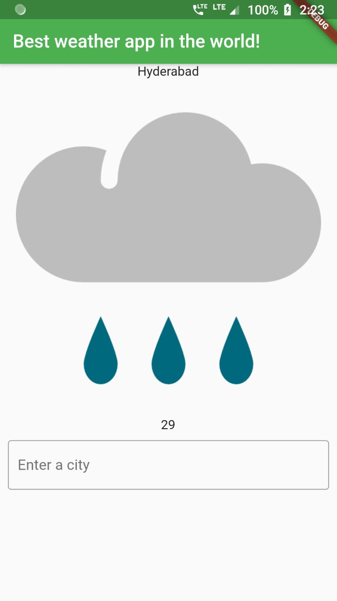

# Moblie Weather Application #

### Prerequisites ###

- A computer running Windows, macOS, or Linux.
- Flutter - See here for installation instructions: https://flutter.dev/docs/get started/install/
- Android Studio (optional for macOS) - Android Studio is required to test your app on Android devices. Install Android Studio here: https://developer.android.com/studio
- A code editor - Visual Studio Code or Android Studio is recommended.
- Xcode (macOS only) - To run your apps on iOS simulators or devices, you'll need the latest version of Xcode installed. (Sorry Windows users, you can't test your app on iOS without a Mac)

>Starter Template at : https://github.com/DSC-FAU/Fun-With-Flutter-Event-Starter

>Created during the event <i>Fun With Flutter</i> conducted by Developer Student Clubs, Florida Atlantic University.
